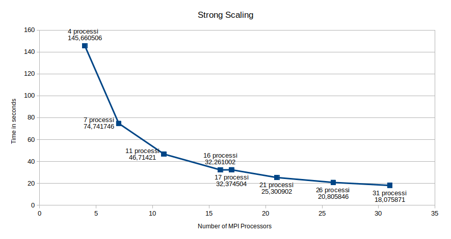
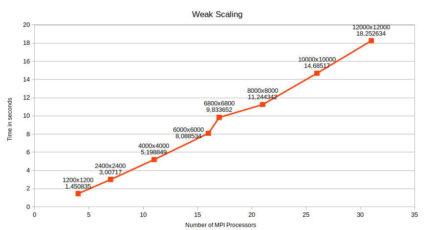

# 1. A simple Jacobi Iteration

L'algoritmo proposto implementa una semplice iterazione di Jacobi per approssimare la soluzione di un sistema lineare di equazioni con connessione Point-to-Point. 

## Sviluppo

Prima di iniziare l'esecuzione del codice, si controlla se la matrice è divisibile per il numero di processori - 1 (in quanto lavorano solo i worker). L'algoritmo genera ed alloca dinamicamente una matrice quadrata con numeri casuali (grazie all'utilizzo di ```srand(13)``` si è riuscito a generare matrici casuali con lo stesso seme). Se il numero di processori è uguale ad 1 esegue il codice sequenziale, altrimenti il processore master divide la matrice per i worker e la invia a questi ultimi. I processori worker computano un'approssimazione per la soluzione dell'equazione di Laplace, associandola ad una matrice xnew, infine computano la diffnorm utilizzando la matrice originale e la matrice xnew e sostituiscono la matrice originale con l'attuale matrice xnew, ripetono questo passaggio fin quando o la diffnorm è maggiore di 1.0e-2 o se il numero di iterazione superano le 100. È stata utilizzata ```MPI_Allreduce``` invece di ```MPI_Reduce``` poiché pur essendo simili allreduce non ha bisogno di comunicare prima col processo master, ma il risultato viene distribuito a tutti i processori.

## 1.1. Fase di Test Locale

Accedi tramite terminale nella cartella estratta precedentemente e dai il comando:

```mpicc -o jacobi jacobi.c -lm```

infine

```mpirun -np 4 jacobi```

il numero ```4``` rappresenta il numero di processori che vengono utilizzati, cioè ```1``` master e ```3``` worker. Possiamo provare vari test con un numero di processori differente, basta che che la taglia della matrice sia divisibile per il numero di processori-1 :
```
MATRIX_SIZE%(size-1)=0
```
esempio di test:

```
mpicc jacobi.c -o jacobi -lm

mpirun -np 4 jacobi

Start computation of process 0 of 4...
Start computation of process 1 of 4...
Start computation of process 2 of 4...
Start computation of process 3 of 4...

Iteration n° 100, the difform is 1.719308e+03

...End of computation time
Computation time: 145,660506 
```

## 1.2. Fase di test su macchine Amazon

Esempio fatto su due istanze di macchine Amazon con 7 processori in totale. Colleghiamoci alle due macchine Amazon tramite ssh, una la utilizziamo come master l'altra come worker1, da terminale inviamo i comandi così come seguono

Compiliamo il programma MPI: 
```mpicc jacobi.c -o jacobi -lm```

Copiamo il programma compilato sul worker1:

```scp -i jacobi worker1@ipinternal:```

Eseguiamo il codice compilato sul cluster: 

```mpirun -np 4 --host master@ipinternal,worker1@ipinternal jacobi```

## Benchmarking

### Strong Scaling
Nella fase di strong scaling è stato testato il programma MPI utilizzando una matrice con taglia 12000x12000, variando solamente il numero di istanze e conseguentemente di processori ed utilizzando su istanze EC2 utilizzando uno StarCluster pubblico basato su ami-52a0c53b (Linux Ubuntu):
1. N° 1 Istanza  -> 4 (3 workers) processori;
1. N° 2 Istanze  -> 7 (6 workers) processori;
1. N° 3 Istanze  -> 11 (10 workers) processori;
1. N° 4 Istanze  -> 16 (15 workers) processori;
1. N° 5 Istanze  -> 17 (16 workers) processori;
1. N° 6 Istanze  -> 21 (20 workers) processori;
1. N° 7 Istanze  -> 26 (25 workers) processori;
1. N° 8 Istanze  -> 31 (30 workers) processori;

I test sono stati effettuati su questo numero di processori in quanto compatibili con la dimensione della matrice. I test mostrano il seguente grafico



#### Commenti della strong scaling
Come si può notare dall'immagine precedente, riguardante la strong scaling, possiamo notare come avendo fissato la grandezza della matrice all'aumentare delle istanze, e quindi dei processori, il tempo computazionale di esecuzione del programma diminuisce sempre più.

### Weak Scaling
Nella fase di weak scaling è stato testato il programma MPI utilizzando matrici variabile in base al numero di processori, ma mantenendo costate la grandezza di matrice inviata ad ogni processore, in questo caso matrici 400x400 ad ogni processore. Sono state utilizzate sempre EC2 utilizzando uno StarCluster pubblico basato su ami-52a0c53b (Linux Ubuntu):
1. N°1 Istanza -> grandezza matrice 1200x1200 -> 4 (3 workers) processori;
1. N°2 Istanza -> grandezza matrice 2400x2400 -> 7 (6 workers) processori;
1. N°3 Istanza -> grandezza matrice 4000x4000 -> 11 (10 workers) processori;
1. N°4 Istanza -> grandezza matrice 6000x6000 -> 16 (15 workers) processori;
1. N°5 Istanza -> grandezza matrice 6800x6800 -> 17 (16 workers) processori;
1. N°6 Istanza -> grandezza matrice 8000x8000 -> 21 (20 workers) processori;
1. N°7 Istanza -> grandezza matrice 10000x10000 -> 26 (25 workers) processori;
1. N°8 Istanza -> grandezza matrice 12000x12000 -> 31 (30 workers) processori;

I test mostrano il seguente grafico



#### Commenti della weak scaling
Come si può notare dall'immagine sopra riportata, riguardante la weak scaling, possiamo notare come avendo fissato il lavoro per ogni processore all'aumentare delle istanze, e quindi dei processori, il tempo computazionale di esecuzione del programma aumenta, questo è dovuto a problemi di tipo di comunicazione di rete.

## Author

* **Giacomo Astarita** - *MPI Jacobi iteration* 
